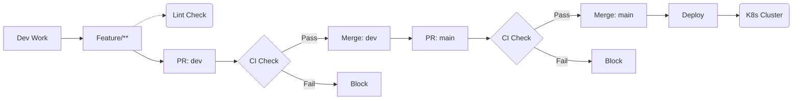

# Modern DevOps Practices: Final Project

This repository contains the final project for the **Modern DevOps Practices** course at **FMI** (2025/2026).

The project demonstrates a complete **automated software delivery pipeline** for a Python web application, following modern **DevOps best practices** and covering multiple phases of the **Software Development Life Cycle (SDLC)**.

## Application Overview

The application is a lightweight **Python Flask web service** that returns a random greeting message to the user.

The application logic is intentionally minimal. This allows the project to focus entirely on **automation, security, and the delivery pipeline**, rather than on code complexity.

## Branching Strategy & Workflow

The project follows a **Structured Gitflow Strategy** with **Branch Protection Rules** to ensure code quality and stability.

### 1. Branch Structure
* **`main` (Production):** The stable branch deployed to the Kubernetes cluster. **Protected:** Direct pushes are blocked; changes require a Pull Request.
* **`dev` (Integration):** The staging branch where new features are combined and tested. **Protected:** CI checks must pass before merging.
* **`feature/**` (Development):** Temporary branches used for developing specific tasks.

### 2. Quality Gates
To ensure stability, we enforce **Protection Rules** on both `dev` and `main` branches:
* **Required Status Checks:** The **CI Pipeline** (`ci-pr.yaml`) must pass successfully (Tests + Security Scans) before merging.
* **Pull Request Flow:** Direct commits are disabled to ensure all code is reviewed.

### 3. Workflow Diagram
The workflow travels linearly from development to deployment.

## Docker Configuration

The application is containerized using Docker with a focus on security and build performance.

### Security Implementation
* **Minimal Base Image:** We use the `python:3.14-slim` image. This significantly reduces the container size and minimizes the attack surface by excluding unnecessary system tools.
* **Non-Root Execution:** For security reasons, the application does not run as the root user. The Dockerfile creates a dedicated user named `appuser` and switches to it, preventing potential privilege escalation attacks.

### Dependency Management & Caching
* **Separation of Concerns:** Dependencies are split into two files:
    * `requirements.txt`: Only production libraries (Flask, Jinja2).
    * `requirements-dev.txt`: Testing and linting tools (pytest, flake8, black, bandit).
    * *Benefit:* The final Docker image installs **only** production dependencies, keeping the artifact lightweight and clean.
* **Layer Caching:** `requirements.txt` is copied and installed *before* the source code to leverage Docker layer caching and speed up builds.
### Build Optimization
* **Layer Caching:** The build process is optimized to use Docker's layer caching mechanism. The `requirements.txt` file is copied and installed before the application source code. This ensures that dependencies are cached and not re-installed on every build unless the requirements actually change.
