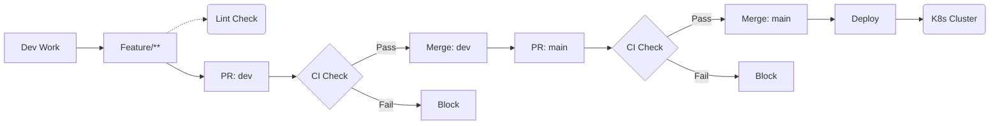

# Modern DevOps Practices: Final Project


This repository contains the final project for the **Modern DevOps Practices** course at **FMI** (2025/2026).

The project demonstrates a complete **automated software delivery pipeline** for a Python web application, following modern **DevOps best practices** and covering multiple phases of the **Software Development Life Cycle (SDLC)**.

## Application Overview

The application is a lightweight **Python Flask web service** that returns a random greeting message to the user.

The application logic is intentionally minimal. This allows the project to focus entirely on **automation, security, and the delivery pipeline**, rather than on code complexity.

## Branching Strategy & Workflow

The project follows a **Structured Gitflow Strategy** with strictly enforced **Branch Protection Rules** on key branches.

### 1. Branch Structure
* **`main` (Production):** The stable branch deployed to the Kubernetes cluster. Merging here triggers the **CD Pipeline**.
* **`dev` (Integration):** The staging branch where new features are combined and tested before reaching production.
* **`feature/**` (Development):** Temporary branches used for developing specific tasks.

### 2. Quality Gates (Main & Dev)
To ensure stability, the following **Protection Rules** are enforced on **both** the `main` and `dev` branches:
* **Direct Pushes Blocked:** Committing directly to these branches is disabled to prevent accidental breaking changes.
* **Required Status Checks:** The **CI Pipeline** (`ci-pr.yaml`) must pass successfully (Tests + Security Scans) before the Pull Request can be merged.
* **Structured Workflow:** Even as a solo project, using Pull Requests enforces a clean commit history and ensures that no code reaches production without passing the automated gates.

### 3. Workflow Diagram
The workflow travels linearly from development to deployment.


## Docker Configuration

The application is containerized using Docker with a focus on security and build performance.

### Security Implementation
* **Minimal Base Image:** We use the `python:3.14-slim` image. This significantly reduces the container size and minimizes the attack surface by excluding unnecessary system tools.
* **Non-Root Execution:** For security reasons, the application does not run as the root user. The Dockerfile creates a dedicated user named `appuser` and switches to it, preventing potential privilege escalation attacks.

### Dependency Management & Caching
* **Separation of Concerns:** Dependencies are split into two files:
    * `requirements.txt`: Only production libraries (Flask, Jinja2).
    * `requirements-dev.txt`: Testing and linting tools (pytest, flake8, black, bandit).
    * *Benefit:* The final Docker image installs **only** production dependencies, keeping the artifact lightweight and clean.
* **Layer Caching:** `requirements.txt` is copied and installed *before* the source code to leverage Docker layer caching and speed up builds.

## CI/CD Pipeline

The project uses **GitHub Actions** to automate testing, security checks, and deployment. The pipeline is split into three distinct workflows to optimize feedback time and resource usage.

### 1. Developer Feedback (`feature-lint.yaml`)
* **Trigger:** Push to any `feature/**` branch.
* **Purpose:** Provides immediate feedback on code style, allowing developers to fix simple issues fast.
* **Steps:**
    * **Formatting:** Runs `Black` to check code style.
    * **Linting:** Runs `Flake8` to catch syntax errors.

### 2. Quality & Security Gate (`ci-pr.yaml`)
* **Trigger:** Pull Request to `dev` or `main`.
* **Purpose:** Ensures code quality and security before merging. If any step fails, the merge is blocked.
* **Steps:**
    * **Code Quality:** Re-runs `Black` and `Flake8` to enforce standards.
    * **Unit Testing:** Runs `pytest` to verify application logic.
    * **SAST (Python):** Uses **Bandit** to scan for Python-specific security issues (e.g., hardcoded secrets).
    * **Advanced Security:** Runs **GitHub CodeQL** for semantic code analysis.
    * **Container Security:** Builds the image and runs **Trivy** to scan for Critical/High vulnerabilities in the OS and libraries.

### 3. Production Deployment (`cd.yaml`)
* **Trigger:** Successful merge to `main`.
* **Purpose:** Deploys the new version to production with zero downtime.
* **Steps:**
    * **Build & Push:** Builds the Docker image and pushes it to Docker Hub with version tags (`sha` and `latest`).
    * **Deploy:** Connects to the Kubernetes cluster and applies the manifests.
    * **Zero-Downtime:** Triggers a rolling update (`kubectl rollout restart`) to gracefully replace old pods with new ones without interrupting service.

 ## Kubernetes Deployment

The application runs on a Kubernetes cluster with a configuration designed for high availability, isolation, and stability.

* **Namespace Isolation:** The application is deployed in a dedicated namespace (`greeting-app`) to ensure logical separation from other cluster resources.
* **Resource Management:** We defined specific **CPU and Memory limits** (Requests: 50m/64Mi, Limits: 250m/128Mi). This prevents the container from consuming excessive cluster resources and ensures predictable performance.
* **Self-Healing:** The deployment includes **Liveness and Readiness Probes**.
    * *Liveness:* Restarts the container if the application crashes/deadlocks.
    * *Readiness:* Stops traffic to the pod if it's not ready to accept requests.
* **Networking & Scaling:** The app is scaled to **2 replicas** for high availability. External access is provided by a **LoadBalancer** on port 80, which routes traffic to the container port 5000.

## Technologies Used

| Category | Technology |
|----------|------------|
| **Core Framework** | Python 3.14, Flask |
| **CI/CD Automation** | GitHub Actions |
| **Containerization** | Docker, Docker Hub |
| **Orchestration** | Kubernetes (Deployment, Service) |
| **Security (SAST)** | Bandit, CodeQL |
| **Container Security** | Trivy (Vulnerability Scanner) |
| **Quality Assurance** | Pytest (Unit Tests), Black, Flake8 |

## How to Run

### 1. Running from Source
To run the application manually without Docker:

**Create & Activate Virtual Environment**
* **Windows:**
    ```bash
    python -m venv venv
    .\venv\Scripts\activate
    ```
* **Linux / macOS:**
    ```bash
    python -m venv venv
    source venv/bin/activate
    ```

**Install Dependencies**
```bash
pip install -r src/requirements.txt
```

**Start Application**
```bash
python src/app.py
```

### 2. Local Testing (Docker)
To run the application in an isolated container:

```bash
# Build the Docker image
docker build -t greeting-app .

# Run the container (Access at http://localhost:5000)
docker run -p 5000:5000 greeting-app
```

### 3. Kubernetes Deployment
Deploy the application to a Kubernetes cluster:

```bash
# 1. Create the namespace and resources
kubectl apply -f k8s/namespace.yaml
kubectl apply -f k8s/deployment.yaml
kubectl apply -f k8s/service.yaml

# 2. Verify the deployment
kubectl get pods -n greeting-app
```
